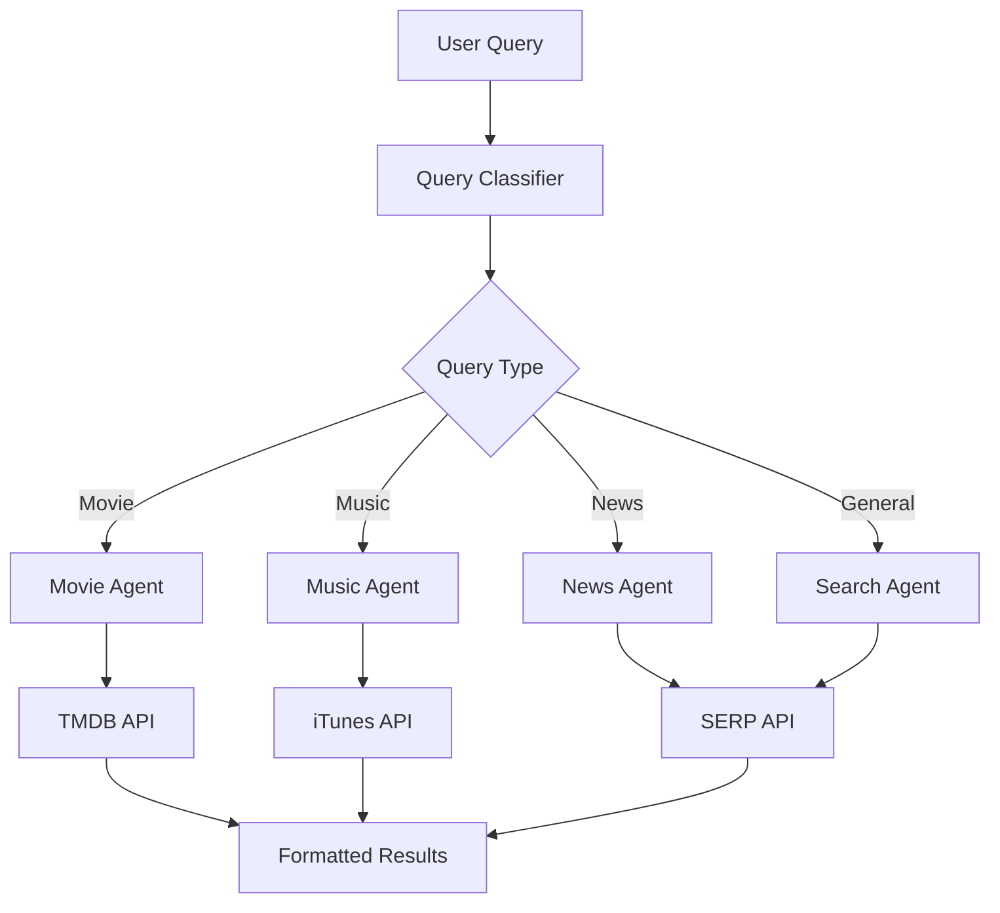

# 🔍 Unified Search System

<div align="center">


*An intelligent multi-domain search system powered by AI agents*

[🚀 Quick Start](#-quickstart) • [📖 Documentation](#-features) • [🛠️ Installation](#-installation) • [🤝 Contributing](#-contribution)

</div>

---

## 📋 Table of Contents

- [🌟 Overview](#-overview)
- [🚀 Quickstart](#-quickstart)
- [✨ Features](#-features)
- [🏗️ Project Structure](#️-project-structure)
- [📂 Project Index](#-project-index)
- [🗺️ Roadmap](#️-roadmap)
- [🤝 Contribution](#-contribution)
- [📄 License](#-license)
- [🙏 Acknowledgements](#-acknowledgements)

---

## 🌟 Overview

The **Unified Search System** is an intelligent search platform that leverages AI agents to provide comprehensive search capabilities across multiple domains. Built with CrewAI and Flask, it automatically determines the type of search query and routes it to specialized agents for optimal results.

### 🎯 Key Highlights

- **🤖 AI-Powered**: Uses CrewAI agents with specialized knowledge domains
- **🔄 Multi-Domain**: Supports movies, music, news, and general web searches
- **🧠 Smart Routing**: Automatically categorizes queries for optimal results
- **🎨 RESTful API**: Clean and intuitive API endpoints
- **⚡ Fast & Efficient**: Optimized for quick response times

---

## 🚀 Quickstart

### Prerequisites

- Python 3.8+
- API keys for TMDB, SERP API
- Azure OpenAI credentials (or compatible LLM)

### Installation

1. **Clone the repository**
   ```bash
   git clone https://github.com/yourusername/unified-search-system.git
   cd unified-search-system
   ```

2. **Install dependencies**
   ```bash
   pip install -r requirements.txt
   ```

3. **Set up environment variables**
   ```bash
   cp .env.example .env
   # Edit .env with your API keys
   ```

4. **Run the application**
   ```bash
   python unified_main.py
   ```

5. **Test the API**
   ```bash
   curl -X POST http://localhost:5000/api/search \
        -H "Content-Type: application/json" \
        -d '{"user_input": "best sci-fi movies 2023"}'
   ```

---

## ✨ Features

### 🎬 Movie Search
- **TMDB Integration**: Comprehensive movie database access
- **Multi-criteria Search**: Genre, actor, director, year, rating filters
- **Rich Results**: Posters, ratings, cast, crew, and detailed descriptions

### 🎵 Music Discovery
- **iTunes API**: Extensive music catalog
- **Artist & Genre Search**: Find music by artist, genre, or keywords
- **Audio Previews**: Direct playback links and album artwork

### 📰 News Aggregation
- **Real-time News**: Latest articles from multiple sources
- **Smart Summarization**: AI-powered article summaries
- **Source Attribution**: Clear source links and publication dates

### 🌐 General Web Search
- **SERP API Integration**: Comprehensive web search capabilities
- **Knowledge Graph**: Rich information panels when available
- **Smart Results**: Curated and relevant search results

### 🔧 Technical Features

| Feature | Description |
|---------|-------------|
| **Smart Query Classification** | Automatically determines search intent |
| **Specialized Agents** | Domain-specific AI agents for optimal results |
| **RESTful API** | Clean endpoints for all search types |
| **Error Handling** | Robust error management and fallbacks |
| **Scalable Architecture** | Modular design for easy extensions |

---

## 🏗️ Project Structure

```
unified-search-system/
├── 📁 templates/           # HTML templates
├── 📄 api_tools.py         # API integration classes
├── 📄 unified_agents.py    # CrewAI agent definitions
├── 📄 unified_tasks.py     # Task definitions for agents
├── 📄 unified_crewai.py    # Main crew orchestration
├── 📄 unified_main.py      # Flask application entry point
├── 📄 requirements.txt     # Python dependencies
├── 📄 .env.example         # Environment variables template
└── 📄 README.md           # This file
```

### 🧩 Architecture Overview



---

## 📂 Project Index

<details>
<summary>Click to expand detailed file descriptions</summary>

### Core Files

| File | Purpose | Key Components |
|------|---------|----------------|
| `unified_main.py` | Flask application entry point | API endpoints, request handling |
| `unified_crewai.py` | Main orchestration logic | Query classification, crew management |
| `unified_agents.py` | AI agent definitions | Specialized agents for each domain |
| `unified_tasks.py` | Task definitions | Instructions for agent execution |
| `api_tools.py` | External API integrations | TMDB, iTunes, SERP API wrappers |

### API Endpoints

| Endpoint | Method | Purpose |
|----------|--------|---------|
| `/api/search` | POST | Unified search (auto-detects type) |
| `/api/movie` | POST | Movie-specific search |
| `/api/music` | POST | Music discovery |
| `/api/news` | POST | News aggregation |
| `/api/general` | POST | General web search |

</details>

---

## 🗺️ Roadmap

### 📅 Current Version (v1.0)
- ✅ Multi-domain search capabilities
- ✅ AI-powered query classification
- ✅ RESTful API endpoints
- ✅ Basic error handling

### 🔮 Upcoming Features (v1.1)
- [ ] **Web Interface**: React-based frontend
- [ ] **Caching System**: Redis integration for performance
- [ ] **Rate Limiting**: API usage management
- [ ] **Authentication**: User management system

### 🚀 Future Enhancements (v2.0)
- [ ] **Book Search**: Goodreads/Google Books integration
- [ ] **Product Search**: E-commerce API integration
- [ ] **Image Search**: Visual search capabilities
- [ ] **Voice Interface**: Speech-to-text integration
- [ ] **Analytics Dashboard**: Usage metrics and insights

---

## 🤝 Contribution

We welcome contributions from the community! Here's how you can help:

### 🛠️ Development Setup

1. **Fork the repository**
2. **Create a feature branch**
   ```bash
   git checkout -b feature/amazing-feature
   ```
3. **Make your changes**
4. **Run tests** (when available)
5. **Submit a pull request**

### 📝 Contribution Guidelines

- Follow PEP 8 style guidelines
- Add docstrings to new functions
- Update README if adding new features
- Test your changes thoroughly

### 🐛 Bug Reports

Found a bug? Please open an issue with:
- Clear description of the problem
- Steps to reproduce
- Expected vs actual behavior
- System information

### 💡 Feature Requests

Have an idea? We'd love to hear it! Open an issue with:
- Clear description of the feature
- Use case scenarios
- Potential implementation approach

---

## 📄 License

This project is licensed under the MIT License - see the [LICENSE](LICENSE) file for details.

```
MIT License

Copyright (c) 2024 Unified Search System

Permission is hereby granted, free of charge, to any person obtaining a copy
of this software and associated documentation files (the "Software"), to deal
in the Software without restriction, including without limitation the rights
to use, copy, modify, merge, publish, distribute, sublicense, and/or sell
copies of the Software, and to permit persons to whom the Software is
furnished to do so, subject to the following conditions:

The above copyright notice and this permission notice shall be included in all
copies or substantial portions of the Software.
```

---

## 🙏 Acknowledgements

### 🔧 Technologies & Libraries
- **[CrewAI](https://github.com/joaomdmoura/crewAI)** - Multi-agent AI framework
- **[Flask](https://flask.palletsprojects.com/)** - Web framework
- **[LangChain](https://langchain.com/)** - LLM integration
- **[TMDB API](https://www.themoviedb.org/documentation/api)** - Movie database
- **[iTunes API](https://developer.apple.com/library/archive/documentation/AudioVideo/Conceptual/iTuneSearchAPI/)** - Music search
- **[SERP API](https://serpapi.com/)** - Web search results

### 🌟 Inspiration
- Modern search interfaces and AI-powered recommendations
- Multi-agent systems and specialized AI assistants
- Open-source community and collaborative development

### 👥 Contributors
- **Your Name** - *Initial work* - [@yourusername](https://github.com/yourusername)

---

<div align="center">

**[⬆ Back to Top](#-unified-search-system)**

Made with ❤️ by the Open Source Community

</div>
